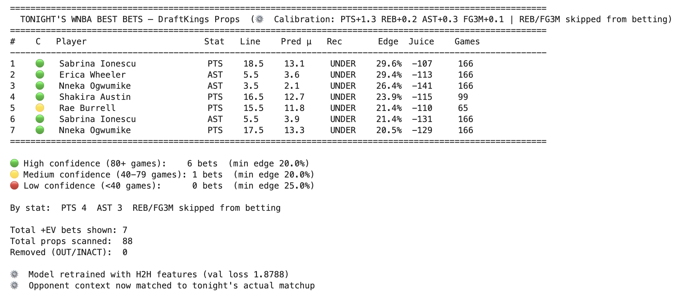

# SportsBetPredictor

A PyTorch multi-output neural network predicting NBA and WNBA player prop outcomes across 72,000+ game logs and 57 engineered features. The pipeline pulls real-time DraftKings lines via The Odds API, calculates expected value on every available prop, and surfaces only statistically favorable wagers above a 20% edge threshold.

Across 400+ live tracked outcomes, high-conviction bets achieved a **56.7% win rate** against a 52.4% breakeven — confirmed by a 12-point gap versus unfiltered bets.



---

## How It Works

The model outputs six simultaneous stat distributions — points, rebounds, assists, blocks, steals, and threes — parameterized as (μ, σ) pairs using a negative log-likelihood loss. At inference time, predicted probabilities are compared against live bookmaker lines to compute edge: the difference between the model's estimated probability and the breakeven probability implied by the juice. Only bets above the edge threshold are recommended.

A key architectural decision was matching opponent context dynamically at inference time. Rather than using features from whoever the player last faced, the prediction function injects live defensive ratings, pace, opponent-vs-position stats, and head-to-head history specific to tonight's actual matchup — fixing a subtle leakage that was distorting edge calculations.

---

## Pipeline Structure

```
NBA_Averages_DataPipeline.ipynb     Data collection and feature engineering
NBA_Averages_TrainingModel.ipynb    Model training and evaluation
NBA_Ev_Calculator.ipynb             EV calculator and prop analysis
NBA_Live_Pipeline.ipynb             Live daily betting pipeline

WNBA_Averages_DataPipeline.ipynb    WNBA data pipeline (2021-2026)
WNBA_Model.ipynb                    WNBA model training via transfer learning
WNBA_Ev_Calculator.ipynb            WNBA EV calculator
WNBA_Live_Pipeline.ipynb            WNBA live pipeline with real-time inference
```

---

## Features

**Rolling form (5-game and 10-game windows)**
Points, rebounds, assists, blocks, steals, threes, minutes, turnovers, field goal attempts, three-point attempts

**Opponent context (matched to tonight's actual matchup)**
Defensive rating, pace, opponent points/rebounds/assists/blocks/steals/threes allowed per game, opponent allowed by position

**Usage and role**
Usage rate, rolling usage rate, relative usage vs team average, usage rank on team

**Head-to-head history**
Average points, rebounds, assists, and threes against tonight's specific opponent across last 5 meetings, number of prior meetings

**Volatility**
Rolling standard deviation and coefficient of variation for points and rebounds

**Situational**
Home/away, days rest, rookie season flag, games played counter

---

## Model Architecture

```
Input (57 features)
    ↓
Trunk: Linear(57→128) → ReLU → BatchNorm → Dropout(0.5)
       Linear(128→64) → ReLU → BatchNorm → Dropout(0.4)
    ↓
6 Heads (PTS / REB / AST / BLK / STL / FG3M)
       Linear(64→32) → ReLU → Linear(32→2) → (μ, log_σ)

Loss: Negative log-likelihood (Normal distribution)
Optimizer: Adam, lr=5e-4, weight_decay=1e-4
```

**NBA:** 56,985 game logs, 51 features, val loss 1.9788
**WNBA:** 15,882 game logs, 57 features, val loss 1.8788 (after H2H feature addition)

---

## Live Pipeline

The daily workflow runs entirely from the live pipeline notebooks:

```
1 hour before games     Pull tonight's props from DraftKings via The Odds API
                        Run injury report check (ESPN API)
                        Generate ranked table of +EV bets

Before each tipoff      Save closing lines per game window for CLV tracking

After games finish      Auto-update results from NBA API box scores
                        Log win/loss, CLV, and edge accuracy by stat
```

Bets are split into **placed** (above 20% edge threshold) and **tracking only** (5-20% edge), with separate performance summaries so lower-conviction bets accumulate data without affecting real P&L.

---

## Calibration and Bias Monitoring

A rolling nightly bias tracker logs the gap between raw model predictions and market lines across all four betting stats. Calibration offsets are tuned based on the average remaining gap across multiple nights rather than reacting to any single slate, preventing overcorrection on small samples.

```
Current offsets:
  PTS   +0.4
  REB   +0.2
  AST   +0.3
  FG3M  +0.1
```

---

## Results

| Filter | Bets | Win Rate |
|--------|------|----------|
| Placed (20%+ edge) | 60 | 56.7% |
| Tracking only (<20% edge) | 367 | 44.7% |
| Breakeven at -110 juice | — | 52.4% |

By stat (placed bets):

| Stat | Win Rate | Bets |
|------|----------|------|
| AST | 75% | 8 |
| PTS | 56% | 39 |
| REB | 50% | 8 |
| FG3M | 40% | 5 |

---

## Tech Stack

Python, PyTorch, scikit-learn, pandas, NumPy, SciPy, NBA API, The Odds API, ESPN API, Jupyter

---

## Notes

Dataset CSV files, model weights, and bet logs are excluded from this repository. The notebooks contain full reproducible code for data collection, feature engineering, model training, and live inference. Running the data pipeline notebooks will regenerate the datasets from the NBA API and The Odds API given valid credentials.
